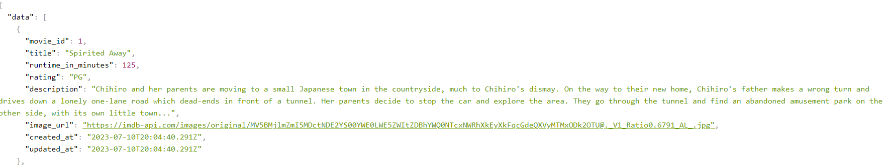
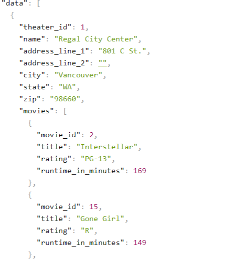

# We Love Movies

This project is a backend project where I connect a database to a RESTful Api and build specific routes that will allow that user to allow users to access data about movies, theaters, and reviews. 


## Installation

To install this project first clone the repositories to your local machine, then cd in to the folder. Finally run npm install to install the node modules.

```bash
  git clone https://github.com/Mculler25/WeLoveMovies.git
  cd WeLoveMovies
  npm install 
```
    
### /movies

This route you can make a get request to get information about the movies.



### /movies?is_showing=true

This route will give you data about the movies that are showing.


###  /movies/:movieId

This route will give you data on a specific movie. If the movie id does not exist a 404 error will return.


### /movies/:movieId/theaters

This route will give you data on all of the theaters where the movie is playing.


### /movies/:movieId/reviews

This route will give you data on all of the reviews with the critic details.


## Reviews

### /reviews/:reviewId

You can make a put request to this route partially or fully update a review. The response will be the review with the critic information. 

```json
{
  "data": {
    "review_id": 1,
    "content": "New content...",
    "score": 3,
    "created_at": "2021-02-23T20:48:13.315Z",
    "updated_at": "2021-02-23T20:48:13.315Z",
    "critic_id": 1,
    "movie_id": 1,
    "critic": {
      "critic_id": 1,
      "preferred_name": "Chana",
      "surname": "Gibson",
      "organization_name": "Film Frenzy",
      "created_at": "2021-02-23T20:48:13.308Z",
      "updated_at": "2021-02-23T20:48:13.308Z"
    }
  }
}
```

You can also delete a review at this route.

If the review id does not exist it will return a 404 error.

## Theaters

### /Theaters

This route will give you the data from the theaters and the movies playing at each theater.

